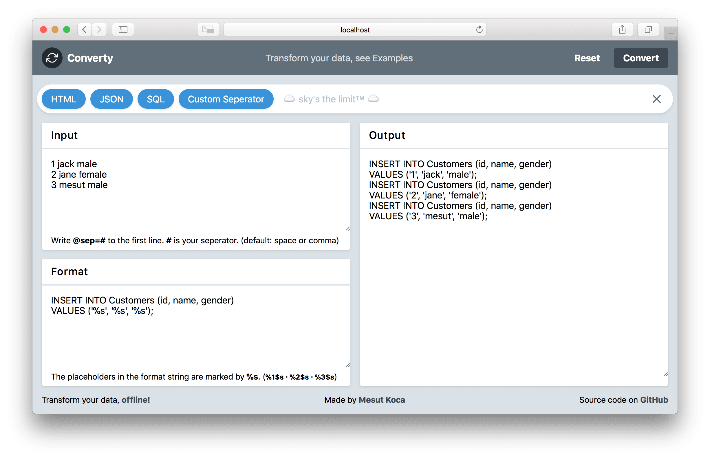

# Converty

Transform your data. It works offline. Built with [Vue](https://vuejs.org/) and [Tailwindcss](https://tailwindcss.com/).

Live: [converty.netlify.com](https://converty.netlify.com)



## Lighthouse

Lighthouse results


## Project setup

```
yarn install
```

### Compiles and hot-reloads for development

```
yarn run serve
```

### Compiles and minifies for production

```
yarn run build
```

### Lints and fixes files

```
yarn run lint
```

### Run the unit tests

```
yarn run test:unit
```

## Dependencies

- [sprintf-js](https://ghub.io/sprintf-js): JavaScript sprintf implementation
- [tailwindcss](https://ghub.io/tailwindcss): A utility-first CSS framework for rapidly building custom user interfaces.
- [vue](https://ghub.io/vue): Reactive, component-oriented view layer for modern web interfaces.
- [vuex](https://ghub.io/vuex): State management for Vue.js

## Licence

[MIT](https://opensource.org/licenses/MIT) © [Mesut Koca](https://mesutkoca.com)
